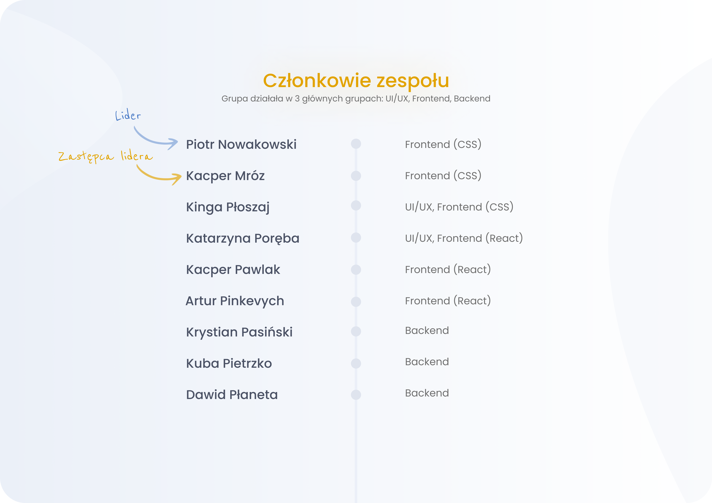
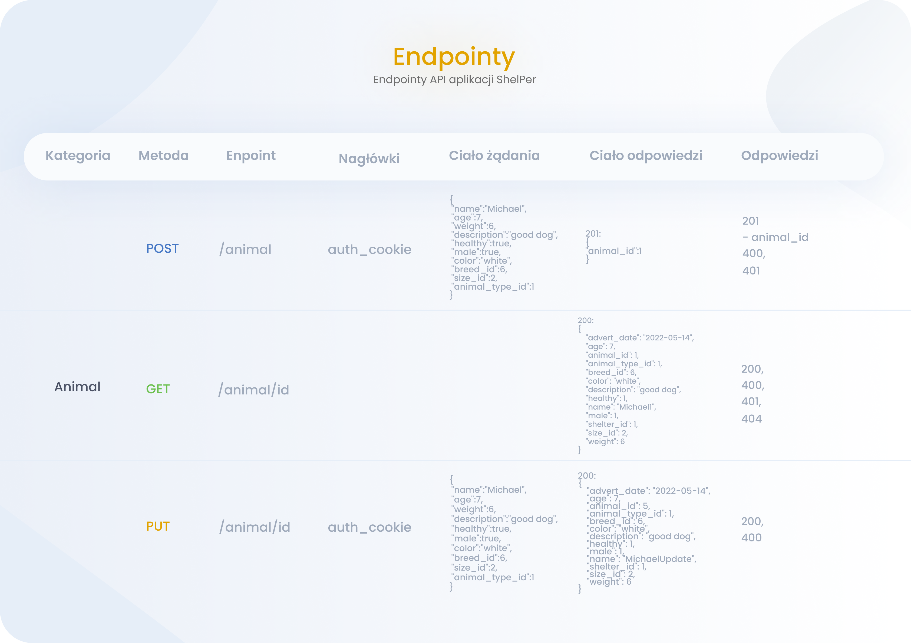
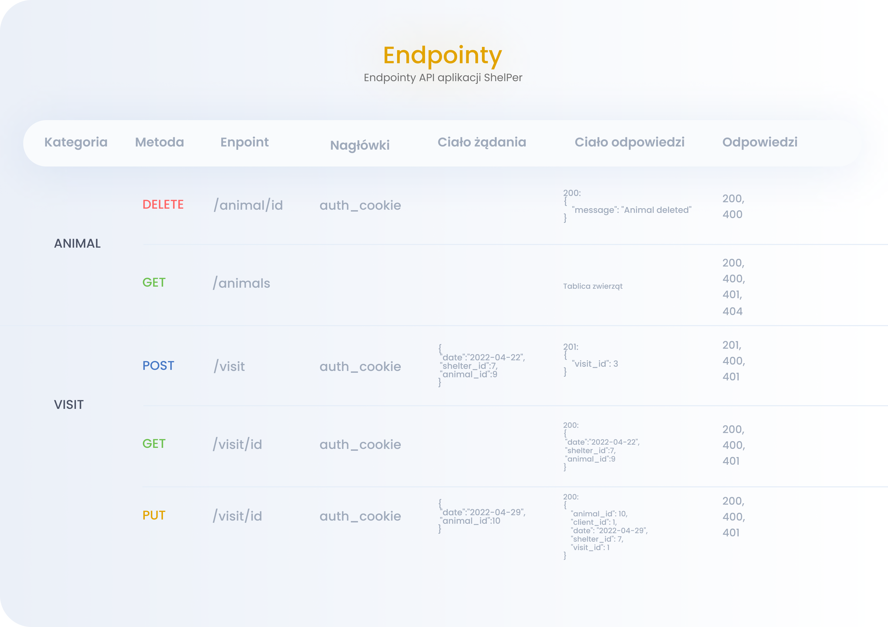
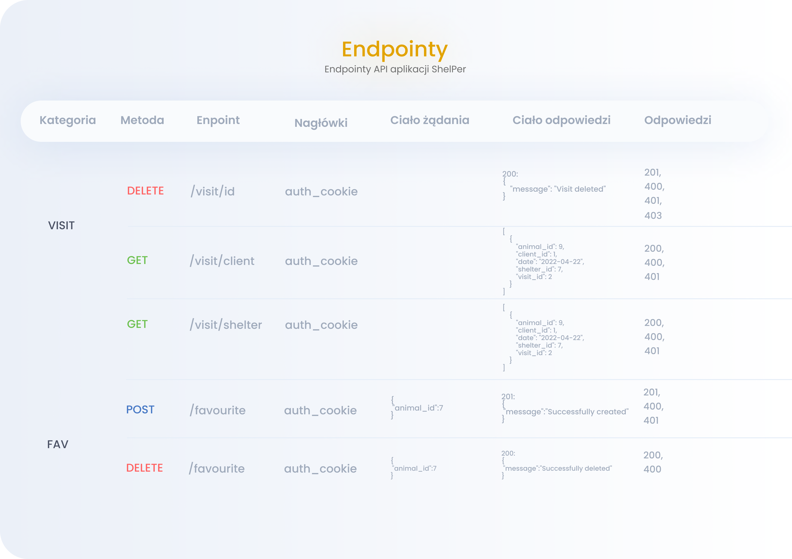
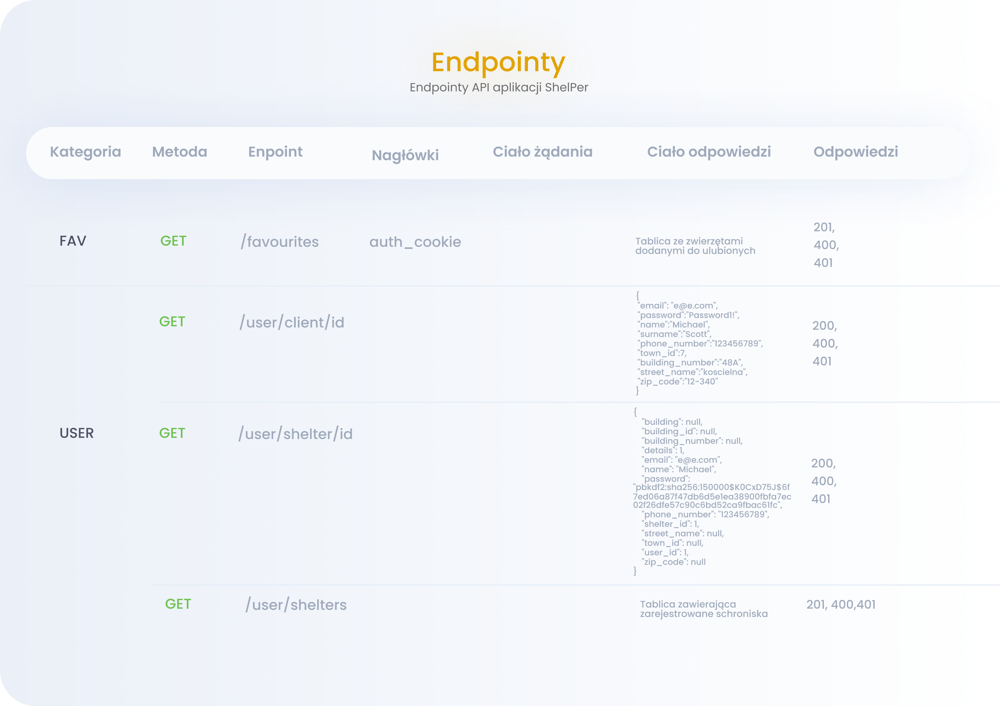

## Prerequisites

Install flask and flask_cors
```sh
sudo apt install flask
pip install flask_cors
```

You need to have nodejs and npm working

## Instalation

Install all required modules by running:
```sh
cd client
npm install
```

## Running

To start server run:
```sh
cd server
export FLASK_APP=shelper
flask init-db
flask run
```

To start frontend, open new terminal and run:
```sh
cd client
npm run
```

## Screenshots








